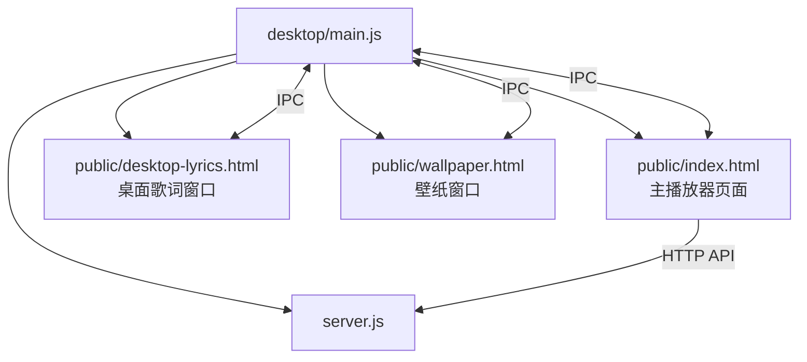
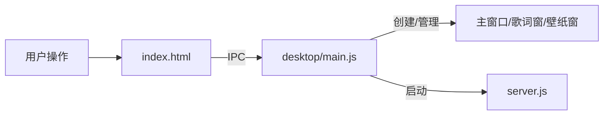
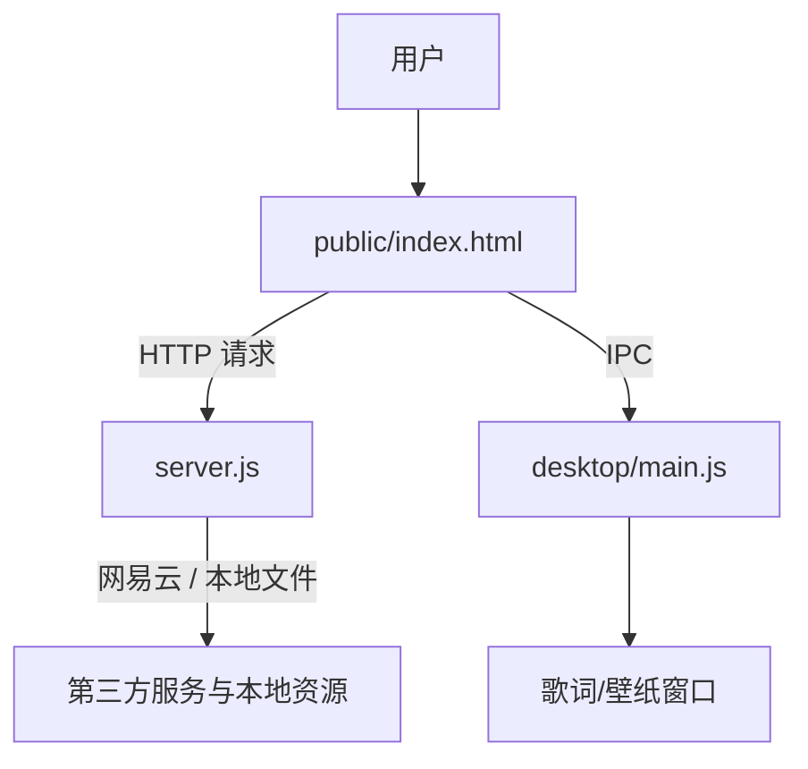

# Mineradio 项目说明

## 1. 项目定位

Mineradio 是一个基于 Electron 的沉浸式音乐播放器，结合了：
- 网易云音乐能力
- 桌面歌词悬浮窗
- 壁纸/背景层
- 3D 视觉与粒子动画
- 天气电台与推荐能力
- 本地更新与安装包分发

它不是传统的多页面 Web 应用，而是由 **Electron 主进程 + 本地 Node 服务 + 单页前端应用** 组成的桌面程序。

---

## 2. 目录结构概览

### 2.1 根目录核心文件

- `package.json`：入口、依赖、Electron 打包配置
- `server.js`：本地 HTTP 服务与网易云接口代理
- `dj-analyzer.js`：DJ / 播客音频分析辅助模块
- `README.md`：项目说明
- `DETAIL.md`：当前项目结构与原理说明

### 2.2 `desktop/`

桌面端主进程相关代码：
- `desktop/main.js`：Electron 主进程核心
- `desktop/preload.js`：主窗口预加载脚本
- `desktop/overlay-preload.js`：歌词/壁纸等辅助窗口预加载脚本

### 2.3 `public/`

前端页面与静态资源：
- `public/index.html`：主播放器页面，承载大部分 UI、动画与业务逻辑
- `public/desktop-lyrics.html`：桌面歌词窗口页面
- `public/wallpaper.html`：壁纸/背景窗口页面
- `public/assets/`：资源文件
- `public/vendor/`：第三方脚本库

### 2.4 `build/`

打包和安装资源：
- 图标、安装器素材、NSIS 脚本、after-pack 脚本等

### 2.5 `docs/`

项目文档与设计说明：
- 各类功能说明、实现说明、存档与视觉规则说明

---

## 3. 页面与窗口关系

Mineradio 的页面不是简单的路由切换，而是多个 Electron 窗口协作：

- 主窗口：`public/index.html`
- 桌面歌词窗口：`public/desktop-lyrics.html`
- 壁纸窗口：`public/wallpaper.html`

它们的关系可以理解为：

### 3.1 主页面 `public/index.html`

主页面是整个产品的核心：
- 播放歌曲
- 搜索音乐
- 展示歌词
- 控制视觉效果
- 管理用户偏好
- 处理桌面模式与全屏模式
- 与主进程通信

它同时包含 HTML、CSS 和大量内联 JavaScript，更像一个“单文件前端应用壳”。

### 3.2 桌面歌词窗口 `public/desktop-lyrics.html`

用于显示独立的歌词悬浮层，通常和主窗口同步：
- 当前播放歌曲
- 歌词内容
- 拖拽、锁定、透明度等状态
- 桌面展示样式

### 3.3 壁纸窗口 `public/wallpaper.html`

用于展示背景或壁纸层，常见用途：
- 作为桌面氛围背景
- 与主页面视觉联动
- 支持透明窗口和独立刷新

---

## 4. 核心模块实现原理

### 4.1 `desktop/main.js`：Electron 主进程

主进程负责“桌面层控制”，主要职责如下：

- 启动本地服务
- 创建主窗口与辅助窗口
- 控制窗口状态：最小化、最大化、全屏、关闭
- 注册全局快捷键
- 处理 IPC
- 打开登录窗口
- 打开更新安装器

它的关键思路是：
1. 先寻找可用端口
2. 启动本地 `server.js`
3. 用 `BrowserWindow` 加载 `http://127.0.0.1:<port>`
4. 通过 IPC 把窗口与系统能力暴露给渲染进程

### 4.2 `server.js`：本地服务与数据代理

`server.js` 是项目的本地能力中心，主要负责：

- 网易云音乐接口封装
- 登录二维码流程
- cookie 持久化
- 歌曲详情、歌词、推荐、歌单等数据
- 音频与封面代理
- 更新相关下载与校验
- 一些天气/电台相关数据

它的实现方式是：
- 基于 `NeteaseCloudMusicApi` 封装各种接口
- 使用本地文件保存 cookie，保持登录状态
- 通过 HTTP 服务给前端提供统一 API
- 必要时对受保护接口附带登录态

文件头部也明确了它的定位：音乐搜索、URL、封面/音频代理、扫码登录、cookie 持久化与试听检测。

### 4.3 `public/index.html`：主播放器与视觉引擎

这个文件是前端的核心，不只是页面模板，而是整个 UI 与视觉系统的主载体。

它包含的关键部分通常有：
- 背景层与封面层
- 3D 画布与粒子效果
- 启动页与过渡动画
- 搜索与播放控件
- 歌词舞台
- 桌面模式与全屏模式控制
- Toast / 提示 / 浮层组件
- 本地存储的视觉配置

它引入了多个视觉与动画库，例如：
- `three.js`
- `gsap`
- `music-tempo`

这说明页面不仅做“播放控制”，还会根据节奏、歌曲状态和视觉模式驱动动画与场景效果。

---

## 5. 模块之间如何协作

### 5.1 典型数据流

### 5.2 播放一首歌的流程

1. 用户在主页面搜索歌曲
2. 前端请求本地 `server.js`
3. `server.js` 调网易云接口获取歌曲、封面、歌词、播放地址
4. 前端更新播放器状态
5. 前端通过 IPC 通知主进程同步状态
6. 主进程更新桌面歌词窗口和壁纸窗口
7. 视觉层根据播放状态、节奏和封面进行动画渲染

---

## 6. 关键技术点

### 6.1 Electron 桌面能力

项目使用 Electron 实现桌面应用能力，因此支持：
- 无边框窗口
- 自定义标题栏
- 透明窗口
- 全局快捷键
- 辅助悬浮窗口
- 安装包与更新

### 6.2 本地服务代理

使用本地 Node 服务的好处是：
- 统一接入外部音乐 API
- 规避前端直接跨域或鉴权问题
- 通过本地文件持久化登录状态
- 为桌面端提供稳定的内部接口

### 6.3 单页大组件式实现

主页面选择了“单页 + 大型内联脚本”的方式，而不是拆成多个前端框架组件。这种方式的特点是：
- 便于在一个文件里集中处理复杂的视觉与交互
- 对高度定制化的 UI 很有效
- 但文件体量大，维护成本也更高

---

## 7. 快速理解建议

如果要快速上手这个项目，建议按下面顺序看：

1. `package.json`：先看入口和依赖
2. `desktop/main.js`：再看 Electron 窗口与 IPC
3. `server.js`：理解本地接口和数据来源
4. `public/index.html`：最后看前端 UI 和视觉实现

---

## 8. 一句话总结

Mineradio 是一个由 **Electron 主进程、Node 本地服务、单页视觉播放器** 组合而成的桌面音乐应用：
- `desktop/main.js` 管桌面窗口和系统能力
- `server.js` 管音乐数据和登录态
- `public/index.html` 管界面、视觉和播放器逻辑
- `desktop-lyrics.html` / `wallpaper.html` 管辅助展示层
